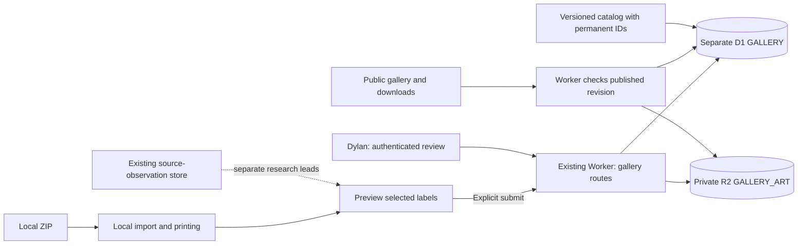

# Community label library implementation plan

Status: implementation approved and built in isolated checkout `/private/tmp/tin-to-cellar-gallery`, branch `codex/community-gallery`, based on verified main `919aa50f461dd63413f6f5d1d99ac611e4a8675c`. Local verification is in progress; nothing has been deployed. Updated September 6, 2026. Plan owner: task `01a07829-c208-71f0-898c-8ba0d2ee95a1`. Originating task: “New voice chat,” `01a07820-27af-7900-a84b-67da7a72777b`. See [operations](gallery-operations.md) for the implemented configuration and release prerequisites.

## Purpose and agreed flow

Let people find and print existing community label designs without generating them in an AI chat. Preserve the recognizable packaging and personal-cellaring purpose of Tin to Cellar.

1. Open a CellarPack ZIP locally and print as today.
2. Select individual usable labels, review their artwork, blend identity, edition, print dimensions, and exactly which reference links will be shared.
3. Choose **Submit for review**. Only the selected artwork and allowlisted metadata upload into private storage.
4. Dylan reviews each label. Approval binds the exact reviewed artwork and metadata version.
5. Approved designs appear publicly under their tobacco blend and can be downloaded as printable CellarPacks. Replacement artwork or material metadata changes require new review.

Private storage necessarily precedes review. Approval permits public access, not the initial private upload. Importing, printing, or viewing the submission preview must never upload artwork. No original ZIP, raw manifest, arbitrary extensions, diagnostic report, process notes, order information, private attachment descriptions, or account context enters the gallery payload. Existing automatic structured diagnostics and source observations remain separate flows.

The user subsequently approved implementation and local end-to-end testing, including the account-free and retention defaults below. Release approval remains separate. Remote resource creation, paid provisioning, pushes, deployments, publication of existing artwork, and contact with outsiders are not authorized. Existing Downloads packs are authorized for local submission tests only.

## Planning baseline and coordination

This section records the pre-implementation snapshot. The implemented catalog now has explicit permanent IDs, trusted imports bypass contribution construction, and gallery tables live in the separate migration. The table sketches below describe responsibilities rather than an exact schema: publication fields and immutable display snapshots are stored on `gallery_submissions` instead of a separate `gallery_publications` table. The migration and operations guide are authoritative for current names and commands.

Read `AGENTS.md` before implementation. Use npm, and uv for any Python. Keep imported text as text; preserve artwork versus sheet geometry, and the artwork-owned blank writing area. Do not add label overlays or notices to printable images.

The saved checkout is mixed. At planning time local HEAD was `cef11584de7542b9c3a9d0a0da312b555c824fea`; local `origin/main` was `769ac6e0bf73d8a6c47ca3ecac0e46dbc19d4ea2`. Neither establishes current production identity. Do not reset, bulk-stage, or deploy this tree. The implementation task should refresh the remote read-only, inspect divergence, and use an isolated checkout of verified current main, carrying only explicitly identified unreleased requirements. Preserve this document and all unrelated changes.

| Coordinated task | Response and integration consequence |
| --- | --- |
| Explain feedback data flow, `01a077de-01c2-7af1-bcc3-c8cd30e4afb5` | Reports implementation complete, no exclusive file ownership. Reports deployment `919aa50f461dd63413f6f5d1d99ac611e4a8675c`, protocol 0.0.20. This is a task-reported deployment, not independently verified here. Preserve diagnostics migrations, operations docs and local findings. Do not read/copy private `.env.diagnostics` or `output/diagnostics`. |
| Add seller protocol endpoints, `01a0747d-5927-7c10-aed1-cb3e3a55f108` | Reports no in-flight work. Current prompt behavior resolves saved source links in the website before copying. Verified in local `origin/main` files `saved-sources.ts`, `use-saved-sources.ts`, and `prompt.ts`, though absent from the saved working-tree baseline. Do not restore the older instruction asking ChatGPT to call the source API. |
| New voice chat, `01a07820-27af-7900-a84b-67da7a72777b` | Owns overall user decisions. Agreed local selection, explicit submission, private review and manual publication. Contributor accounts remain undecided. |

The diagnostics task also reviewed this plan's integration boundaries. Its two corrections are incorporated below: scope the diagnostics dialog's local-file promise to that submission, and suppress trusted-demo/gallery contribution construction before the always-mounted sending effect, including stale report state.

Current contracts worth retaining:

- `src/App.tsx` imports bytes locally, creates artwork Blob URLs, and independently prepares diagnostic contributions. `src/components/ContributionStatus.tsx` submits structured contributions automatically; optional process notes require explicit sharing.
- `worker/contributions.ts` owns public source suggestions through `CatalogContributions` Durable Object. `worker/diagnostics.ts` and `migrations/0001_diagnostics.sql` own D1 diagnostics. Source URLs are not gallery images.
- `src/lib/tobacco-catalog/index.ts` derives IDs from names at runtime. `scripts/catalog/merge.mjs` regenerates the source and frontend catalogs without permanent IDs.
- `src/lib/cellarpack/` validates local packs and geometry. Its browser image decoding paths cannot simply be assumed to run in a Worker.
- `src/lib/cellarpack/cellarpack-v1.schema.json` requires research fields, including at least one source and palette entry. Public downloads need an honest minimal reconstruction, not a copy of private research.
- `src/components/ExamplePack.tsx` already distributes a fixed ten-label pack and feeds example imports through ordinary contribution handling. Preserve its artwork; exclude built-in demo actions from new gallery submissions and diagnostic collection.
- `wrangler.jsonc` has one Worker, D1 `DIAGNOSTICS`, source Durable Object, and a daily scheduled handler. `.github/workflows/deploy.yml` deploys successful main pushes. A push is therefore a release action.

The preceding audit passed 40 focused existing tests in six files. This document adds no implementation tests or hosted verification claims.

## V1 defaults accepted with implementation approval

| Choice | Recommended starting point |
| --- | --- |
| Contributors | No account, public profile, email requirement, comments, or ratings. Successful upload ends with “Submitted for review”; no contributor status link or withdrawal control is provided. Dylan uses authenticated admin access. |
| Submission unit | One label per server submission; select at most 5 in one UI action and send sequentially. Show per-label outcomes, not all-or-nothing success. |
| Formats | Sharing accepts static, non-interlaced, 8-bit RGB/RGBA sRGB PNG only. 8 MiB input cap, 825–2048 pixels per side, square canvas. Existing local importer remains broader. No silent resizing to meet limits. |
| Print support | V1 gallery accepts the current 2.5-inch circle / Avery 94502 geometry, 0.125-inch bleed and safe inset; at least 300 PPI. Preserve each valid blank writing area's geometry. |
| Metadata | 16 KiB JSON, max 3 explicitly selected public product reference URLs, 1,500 characters per URL, edition text 120 characters, unknown maker/blend 160 each. Fixed package/variant categories. No contributor biography, filename, raw notes or open-ended comments. |
| Upload reservation | Expires in 1 hour; identical upload retries allowed while reserved. A completed pending item cannot be overwritten. |
| Retention | Pending review 30 days. Rejected originals and derivatives deleted within 7 days; abandoned reservations within 24 hours after expiry. Minimal private moderation receipt retained 90 days after terminal decision. Published artwork remains while published. |
| Unpublish | Public access stops immediately for subsequent requests; retain private reviewed copy for 30 days for correction/review, then delete unless republished. A rights/privacy removal can request deletion sooner. Downloads already made cannot be recalled. |
| Intake caps | Burst limiter 5 new reservations/minute/IP; exact admission quota 20 labels/day per daily salted IP hash, 100/day site-wide, 500 active pending/reserved items, 1 GiB pending input bytes. Reserve worst-case derivative capacity as well. Proposed total managed R2 cap 8 GiB. |
| Cost posture | Use R2 Standard. Assume Workers Paid is needed for bounded image decoding; verify existing plan before any upgrade. No paid image service, Queues, KV, new Durable Object, contributor account service, or email service in v1. |

These caps deliberately constrain sharing, not local printing. If a valid local label cannot be submitted, show why and let the user continue printing. Benchmark image processing before locking the upper limit. Account-free submission with a simple confirmation is the current approved direction.

## Architecture and access boundaries



Add D1 binding `GALLERY`, database proposed name `tin-to-cellar-gallery`, and `migrations_dir: migrations/gallery`. A separate database keeps gallery schema, backups, retention and rollout independent of `DIAGNOSTICS`; it does not imply a separate application service. Add private R2 binding `GALLERY_ART`, proposed bucket `tin-to-cellar-gallery`. Actual resource IDs come from authorized provisioning, never placeholders deployed as real IDs.

Keep R2 public domain and `r2.dev` access disabled. All artwork, thumbnails and ZIP downloads pass through the Worker. Object keys are internal, unpredictable and immutable; possession of a key is not authorization. Do not issue direct R2 public/presigned read links for pending or published files. This keeps unpublish enforcement in one place. [R2 access](https://developers.cloudflare.com/r2/buckets/public-buckets/) and [Worker API](https://developers.cloudflare.com/r2/api/workers/workers-api-reference/).

No cross-store transaction exists between D1 and R2. Treat every file operation as recoverable preparation followed by a conditional D1 state change. Failed preparation leaves an unreachable artifact for cleanup, never a published record with missing files.

## Permanent catalog identity

Freeze today's derived IDs as explicit `id` values in both `data/catalog/catalog.json` and `src/lib/tobacco-catalog/catalog.json`. Do not replace existing IDs with new UUIDs. Before conversion, snapshot the full ID-to-name mapping and assert uniqueness. Update the merge script to preserve IDs using a checked-in identity registry/alias mapping, and fail ambiguous matches rather than silently assigning another identity.

Rename changes maker/blend display values and search aliases, not the ID. New entries receive an explicitly stored unused ID. Name aliases aid search; ID aliases resolve old external identifiers. Keep these two concepts separate. D1 `gallery_tobaccos` is a versioned projection of the repository catalog, not a second independently edited catalog. A seed/upsert script updates display fields and aliases without deleting referenced entries.

Existing source observations already use current IDs, so freezing them should require zero source-record rewrites. Add old maker/blend spellings to exact identity matching so historical packs still match after a rename. The public source API resolves supported historical ID aliases without changing or revalidating historical diagnostic records. A true catalog merge is an explicit reviewed data migration with a redirect and source reconciliation, not a side effect of correcting typography. Do not touch legacy diagnostic migration to achieve it.

For an unknown blend, retain bounded proposed maker/blend names privately with `catalog_id = NULL`. Dylan can map it to an existing record. If it is new, add it through the catalog maintenance workflow and sync the catalog before approval. V1 admin does not create a second unsynchronized catalog. Publication requires an active permanent catalog ID.

## D1 schema sketch

All timestamps are server UTC; enable foreign keys, state CHECK constraints and unique indexes. Draft names below are contracts to refine in the migration, not SQL applied by this plan.

| Table | Key fields and constraints |
| --- | --- |
| `gallery_tobaccos` | `id PK`, maker, blend, search aliases JSON, active, catalog_revision. No destructive seed deletion. |
| `gallery_catalog_aliases` | `alias_id PK`, `catalog_id FK`. Explicit redirects only; reject cycles. |
| `gallery_submissions` | `id PK` random, `capability_hash`, `request_hash`, state, `row_version`, created/expiry times, nullable catalog FK, bounded proposed identity, upload lease, submitted hash/size, canonical image hash, canonical metadata JSON/hash, consent version/time, supersedes nullable FK, terminal reason code, deletion state. Capability never public. |
| `gallery_assets` | `id PK`, submission FK, kind `artwork/thumbnail/pack`, internal R2 key UNIQUE, SHA-256, bytes, dimensions, created time, deletion_due, deletion_done. Unique immutable version keys; no raw original ZIP. |
| `gallery_publications` | `id PK`, submission FK UNIQUE, catalog FK, approval digest, approved row version, status `published/unpublished`, reviewed metadata snapshot, reviewer subject, approved/published/unpublished timestamps, immutable artwork/thumbnail/pack asset FKs. Filter indexes on status/catalog/edition/geometry/date/id. |
| `gallery_review_events` | event ID, submission FK, actor subject or `contributor`, fixed action/reason, expected/result versions, digest, timestamp. No raw IP, access token or free-text private research. |
| `gallery_admission` | bucket key/day, reserved count/bytes and daily admissions, expiry. Conditional transactional admission, not estimates from edge rate limits. |
| `gallery_settings` | singleton submission/publication/serving switches, capacity ceilings, notice versions. Missing or unreadable configuration fails closed. |

Keep a typed public projection that cannot serialize capability hashes, private identity proposals, review history or asset keys. Index all retention/status/catalog queries. Bound admin and public pagination, default 24/max 50 items with opaque validated keyset cursor; no arbitrary SQL sort/filter expressions.

## Submission contract, authentication and state machine

The browser constructs `GalleryLabelDraft` v2 by picking named fields from a successfully imported label: version, submissionId, tobacco (catalogId or maker/blend), artworkProfileId, writingArea geometry, optional edition/altText/evidence, verified image measurements, and acknowledgement. Evidence can retain package, variant, and explicitly selected public reference URLs for private review. The server accepts exact keys only. Public cards receive a flat projection without the submission envelope or evidence.

Before the first POST the browser creates a random internal nonce and submission ID and retains them in the same tab only for reservation/upload retry. The nonce is sent in the Authorization header and hashed server-side. It is not exposed in a link or downloadable receipt. Successful upload shows “Submitted for review.” There is no contributor status, private preview or withdrawal endpoint; Dylan manages submissions through private review.

Use same-origin mutation checks, correct content types, bounded body reads, no permissive CORS, and no secret in browser bundles. Add Turnstile to the explicit submission step, with server verification of success/hostname/action and token freshness. It is not an account or a guarantee against abuse. Replays of an already committed operation with the same internal nonce and request hash must return its current state without requiring reuse of a consumed challenge. New reservations need a fresh valid challenge. [Turnstile verification](https://developers.cloudflare.com/turnstile/get-started/server-side-validation/).

Protect `/admin/gallery` and `/api/gallery/v1/admin/*` with Cloudflare Access restricted to Dylan's actual chosen identity. Verify the signed Access JWT inside the Worker using configured issuer, audience, expiry and allowlisted subject; do not trust a plain email header. Bind authorization to every review, private preview and publish request, and enforce Origin/CSRF protection on cookie-authenticated mutations. Configure Worker-first routing for `/admin/*` as well as `/api/*`; protect both production domains and fail closed if Access configuration is missing. Keep `workers.dev` and preview bypasses disabled. Local tests inject a fake verifier only in the test/dev harness, never via a production bypass query. Actual identity and Access configuration remain prerequisites. [Access JWT verification](https://developers.cloudflare.com/cloudflare-one/access-controls/applications/http-apps/authorization-cookie/validating-json/).

```text
reserved -> uploading -> pending -> preparing-publication -> published -> unpublished
    |           |           |                 |
 expired     invalid     rejected          pending
terminal/unpublished expiry -> deleting -> deleted
```

Uploading/preparing states have expiring leases. Failed preparation returns to pending with a typed error, not approval. Rejected or expired submissions are terminal; historical withdrawn state remains for cleanup; resubmission has a new ID and consent. Unpublished exact versions may be republished only through an explicit reviewer action before deletion. Admin unpublishing stops public access; historical withdrawn records remain subject to retention but no new contributor withdrawal action is exposed. Every transition uses an expected version and state in a conditional update; stale actions return `409` with fresh state. Approval checks the digest over canonical artwork hash + canonical metadata hash + catalog ID + format version. Any correction increments the version and invalidates previous review readiness. A replacement is a new linked submission; the old published design can remain until Dylan explicitly replaces/unpublishes it.

## Worker API sketch

Base `/api/gallery/v1`; admin routing may share this prefix but must be included in the configured Access policy. The final route matcher must use exact paths/methods.

| Method and route | Auth and behavior |
| --- | --- |
| `POST /submissions` | Internal nonce + challenge. Strict metadata creates idempotent reservation and reserves quotas; returns ID/state/expiry and allowed upload route, never a public URL. Same ID/capability/hash returns existing result; different content returns 409. |
| `PUT /submissions/:id/artwork` | Internal nonce, raw `image/png`; size/hash must match reservation. Conditional upload lease prevents simultaneous overwrite. Validate/canonicalize/store before moving to pending. Identical retry returns upload confirmation; changed bytes require new submission. |
| `GET /admin/submissions` and `GET /admin/submissions/:id` | Access; private pending queue, full canonical image, safe metadata/reference links, exact-duplicate hints, validation results and history. |
| `GET /admin/submissions/:id/artwork` or `/thumbnail` | Access; private reviewed assets through authenticated routes, no-store. Only the human admin identity authorizes these routes. |
| `PATCH /admin/submissions/:id` | Access + expected version; correct identity, edition, selected references or accessible gallery description while pending. No image replacement. |
| `POST /admin/submissions/:id/approve` or `/reject` | Access + expected version/digest; approve prepares derivatives/pack and commits publication only if state is still eligible. Reject uses bounded reason codes. |
| `POST /admin/publications/:id/unpublish` or `/republish` | Access + expected version; revokes or restores the exact reviewed version. |
| `GET /labels?catalogId=&edition=&geometry=&cursor=` | Public; published projections only. Search maker/blend via canonical catalog; no private submission search. |
| `GET /labels/:id`, `/thumbnail`, `/artwork`, `/pack` | Public only after current publication gate. Fixed MIME, nosniff and safe Content-Disposition for files. Missing/unpublished returns 404. |

Use structured failures such as `limit_exceeded`, `unsupported_image`, `invalid_geometry`, `catalog_mapping_required`, `review_changed`, `storage_unavailable`. A response can be lost after durable success: an identical same-tab reservation/upload retry resolves it without creating a duplicate. The batch UI retains internal retry state only for unresolved items; completed items show “Submitted for review.”

## Image validation, fidelity and duplicate handling

Perform bounded stream reading before decoding. Enforce actual byte count even without or against a false Content-Length. Validate signature, chunk order/CRC/end, dimensions before allocation, inflated pixel length, valid filters, no APNG, no unsupported color depth/interlace/profile, and full pixel decoding. Do not rely on filename, client hash, PNG header or the browser's prior acceptance. Reuse pure geometry checks; do not import the browser ZIP/image stack wholesale into the Worker.

Use a pinned Worker-compatible PNG decoder/encoder, with `fast-png` already present as a development dependency as a candidate to benchmark, not an assumed production dependency. Reject or explicitly normalize incompatible profiles before review; never strip a non-sRGB profile and call the result sRGB. Canonicalize by lossless decode/re-encode without textual/EXIF/private ancillary chunks, retaining dimensions, decoded pixels and appropriate sRGB information. The canonical image is what Dylan and the contributor preview, what its receipt hashes, and what publication serves. Do not retain the pre-normalization input in R2. This changes file bytes before review, not the approved artwork afterward. Warn users to inspect visible artwork too; metadata removal cannot remove personal text drawn into pixels.

Generate a 320px thumbnail from canonical pixels with an alpha-aware area filter. It is for browsing only. No upscaling, recoloring, added date surface, borders or watermarks. Printing and ZIP downloads use full-resolution canonical PNG bytes. Show full-resolution review, actual-size preview, blank-panel geometry and source links; do not automatically fetch remote reference images server-side. Admin may open an external source deliberately. Include alt text for public gallery images, reviewed alongside metadata; no new AI calls are needed.

At 2048 square, one RGBA pixel buffer is 16 MiB. Measure concurrent decoding, encoding and ZIP preparation under the Worker isolate limit, not only individual operations. Propose a 2,000ms CPU ceiling for the shared Worker only after checking its diagnostics schedule fits that limit; otherwise keep the existing schedule limit and bound gallery processing separately. The 10ms Free CPU limit is not a credible untested assumption for this processing. Failure of the benchmark means reducing the sharing cap or choosing another reviewed processing design, not weakening checks. [Worker limits](https://developers.cloudflare.com/workers/platform/limits/).

Dedupe by canonical image hash + catalog ID + geometry + edition/reference metadata digest. Same pixels with different edition claims require review, not silent merge. Match an existing published version by linking it to the submitter instead of publishing another copy. Do not reveal other pending/rejected submissions or their submitters. V1 may store separate pending copies to keep deletion ownership simple; cross-submission physical asset sharing and reference counts are deferred. Hashing verifies identity and exact duplicates, not authorship or packaging fidelity.

## Publication, downloads and revocation

Prepare a deterministic one-label CellarPack before the conditional publish commit. Use server-assigned pack UUID and frozen creation timestamp, controlled file paths, canonical image SHA/dimensions/sRGB/alpha, reviewed surface and blank write-in metadata, and compatible default print intent. ZIP compression need not recompress PNG; use stable STORE entries and stable timestamps. Store the resulting pack hash and byte count beside its object. Never rebuild different bytes under an approved asset key.

Shared pack export uses top-level optional edition and altText, expands the artwork profile into print geometry, and preserves the validated writing area. Research is optional and is omitted by the gallery exporter; do not invent placeholder observations. Validate the assembled pack against the current CellarPack schema and real importer.

Public API gates every image, thumbnail, ZIP and detail request on current publication status using primary-consistent D1 reads. V1 uses `Cache-Control: no-store` and no CDN/Cache API cache for these responses. This trades cache savings for straightforward unpublish behavior. Do not later introduce caching or public bucket URLs without a purge/revocation design. Avoid stale replica reads for access decisions; use a session beginning at primary if read replication is enabled. [D1 consistency](https://developers.cloudflare.com/d1/best-practices/read-replication/).

Public gallery filters maker/blend, packaging edition and geometry; the v1 geometry filter has only the supported Avery-compatible shape. Multiple reviewed designs per blend are allowed. Public “Use these labels” can assemble a small selection locally using the same safe reconstruction contract and then import it. Start with individual “Use label” and one-label downloads; multi-label selection is a follow-on after limits and import behavior pass. Import of an internally downloaded gallery label must not feed its reference links back into automatic observations or let a contributor resubmit it as newly created. Track trusted in-app origin separately from untrusted manifest flags. Local-file reimports cannot reliably prove origin; exact server dedupe handles resubmission, and existing feedback reports must not be invented for reconstructed gallery packs.

Unpublish hides the listing and denies subsequent artifact requests even if R2 still holds files. An already authorized in-flight response may finish, and prior downloads/screenshots cannot be recalled. Approval/rejection is an editorial action, not a rights clearance claim. Keep public source-link suppression and artwork unpublishing separate.

## Retention, cleanup and operating limits

Reserve admission and worst-case storage capacity in one conditional D1 transaction before accepting bytes. Include derivative and pack overhead, provisionally 40 MiB per maximum-size input, then reconcile down to actual committed sizes. Canonical PNG encoding can be larger than the uploaded file; enforce an 18 MiB canonical-output cap and account for both the full PNG and its copy in the ZIP. Enforce bounded reads/decode limits independently. Cloudflare's rate limiter is a burst guard, not a precise daily budget; exact counters and conditional reservations live in D1. Use short-lived daily salted IP hashes for quotas, purge after 48 hours, and do not log raw IPs or capabilities. [Rate-limit accuracy](https://developers.cloudflare.com/workers/runtime-apis/bindings/rate-limit/).

Daily gallery cleanup joins the existing scheduled entrypoint as an independent bounded job. Failure in gallery cleanup must not skip diagnostics cleanup, or vice versa. Paginate expired records and R2 listings, use resumable cursors and leases, and report aggregate failure/count metrics without payloads. Hide expired content, including historical withdrawn records, at read time regardless of cleanup success. Delete objects, confirm the absence, then mark deletion and release reserved capacity. A failed delete retains accounting and retries. Do not clear all D1 metadata before R2 deletion is recoverable.

An R2 orphan sweep identifies objects with no live owning DB record only after a 24-hour grace period, respecting active upload/publish leases. D1 rows without objects are never publishable and become explicit recoverable failures. Avoid broad R2 age rules that could erase published files; use prefix-specific lifecycle rules only as a fallback for abandoned temporary objects. [R2 lifecycle rules](https://developers.cloudflare.com/r2/buckets/object-lifecycles/).

Retain published consent/review metadata while published. After rejection or deletion, keep only the stated 90-day minimal receipt and moderation reason, then remove it; do not retain raw files indefinitely for vague abuse prevention. Document provider backups separately without promising instantaneous backup erasure. If removal requires a temporary block against identical resubmission, store a separate private suppression hash under an explicit reviewed retention policy; it is not an implicit permanent blacklist.

Add admin counts for pending age, reserved/storage bytes, failed cleanup, and publication failures. Manual dashboard review is enough for v1; do not create another scheduled Codex automation in this implementation without a request. Intake closes with a clear retry-later message when caps are reached; local printing remains usable. These controls bound admitted storage/processing, not every network request cost under attack.

## Cost estimate and provisioning boundary

Official pricing checked September 6, 2026; confirm account usage and rates at release. Included allowances are shared and must not be treated as this app's unused budget.

| Service | Current documented basis and planning consequence |
| --- | --- |
| R2 Standard | $0.015/GB-month, $4.50/million Class A operations, $0.36/million Class B; 10 GB-month, 1 million A, 10 million B included; Internet egress free. 1,000 labels at roughly 3 MB canonical PNG + 3 MB ZIP + 0.1 MB thumbnail ≈ 6.1 GB, plus pending files. This could fit included storage if otherwise unused; it is not a free-hosting promise. [R2 pricing](https://developers.cloudflare.com/r2/pricing/) |
| Workers | Paid starts at $5/month with 10 million requests and 30 million CPU-ms included, then $0.30/million requests and $0.02/million CPU-ms. 1,000 uploads at measured 500ms CPU would be 0.5 million CPU-ms; 100,000 gallery artifact requests still require status checks. Estimate after profiling, not from file size alone. [Workers pricing](https://developers.cloudflare.com/workers/platform/pricing/) |
| D1 | Paid includes 25 billion rows read/month, 50 million rows written/month and 5 GB; excess $0.001/million reads, $1/million writes, $0.75/GB-month. Free daily caps differ. Indexed per-label reads matter more than database count at this scale. No blobs or base64 artwork in D1. [D1 pricing](https://developers.cloudflare.com/d1/platform/pricing/) |

R2 storage may be small initially, but the Worker plan, Access configuration, abuse traffic and other account usage still matter. Set a proposed operator alert at $10/month attributable/incremental gallery spend where account tooling permits; it is a notification target, not a provider-enforced hard cap. Do not upgrade, provision or purchase anything during planning. Verify whether existing Workers Paid/R2/Access/Turnstile arrangements cover the design before requesting a concrete release approval. No third-party AI generation is part of gallery operation.

## Audit fixes and exact proposed copy

Keep the existing footer muted and subordinate with its current `.footer-notice` styling. Proposed text:

> For adults 21+. Personal cellaring only; no resale or commercial packaging. Independent of tobacco brands. No tobacco sold.

About addition:

> Tin to Cellar is an independent tool, not affiliated with or endorsed by tobacco brands. It adapts recognizable packaging for personal jar labels. Brand names and original packaging artwork belong to their respective owners. Using the tool does not grant permission to reuse those designs.

Artwork-sharing notice beside selection and submission:

> Your ZIP is read on this device. Only labels you choose to submit are uploaded for private review. Approved labels become public so others can download and print them for personal cellaring.

Submission acknowledgement, separate from automatic diagnostics:

> I created or generated these label designs and want Tin to Cellar to host and share my contribution for personal cellaring. I understand that the original brand artwork may belong to others.

This records the contributor's intention about their contribution; it is not a claim they own tobacco-brand rights. Record the displayed notice version, selected field digest and server receipt time. If broader contributor licensing language is desired, decide its scope before publication rather than inventing brand permissions.

Private-review receipt:

> Submitted for review.

Retention addition:

> Unreviewed submissions expire after 30 days. Rejected artwork is deleted within 7 days. We keep a limited review record for 90 days after the decision. Published labels stay available until unpublished. Copies already downloaded by others cannot be recalled.

Automatic-collection notice, retaining current source policy unless separately changed:

> Importing automatically shares structured AI feedback, ZIP-check results, and eligible package-source links. Those links may appear in public source suggestions. This does not share your artwork. Process notes require a separate sharing action.

Replace source-privacy guarantees with:

> The app filters source links by format. It cannot verify that every link is public or that its path contains no personal information.

The newer website prefetch also needs Privacy wording: selecting recognized blends can request saved source suggestions from Tin to Cellar; only chosen source websites are visited in the AI chat or when the user opens a link. Do not retain the older statement that only the AI requests the source API.

Correct `HowItWorks.tsx` instructions to point to **View shared diagnostics** and **Report a failed AI run**, not deleted download/comparison controls. In `ContributionStatus.tsx`, replace the broad `Your ZIP and artwork stay on this device` with `This diagnostics submission does not upload your ZIP or artwork.` The old sentence becomes misleading once someone explicitly uploads artwork through the gallery in the same session. Audit other broad local-artwork claims in Privacy/landing/import notices for the same exception; order-only local-processing notices remain accurate.

Exclude trusted built-in example and internal gallery-use actions from automatic diagnostics/source contribution. Suppress contribution construction and clear contribution/feedback/retrospective state before the always-mounted `ContributionStatus` effect. Merely hiding the panel, removing AI feedback or clearing source links is insufficient: `websiteValidation` creates a version-2 validation-only submission. Keep manual ordinary ZIP imports as documented.

Canonical prompt addition, published as a new immutable patch release:

> Create these labels for the user's personal tobacco cellaring. They are not for resale or commercial packaging. Tin to Cellar is independent of tobacco brands; do not describe the labels as official, endorsed, or licensed. Reference approval selects the packaging edition and does not establish permission to reuse its artwork.

Also replace the prompt's guarantee that shared source records contain no personal data with an instruction to include only ordinary public product links and a warning that eligible links may be published. Preserve reference approval, source prefetch, five-attempt limit and partial-pack behavior. Regenerate public instructions through the existing release script; never hand-edit historical snapshots.

Preserve the ten-label demo assets pending an explicit keep/replace decision. Proposed caption: `AI-generated examples for personal cellaring. Not official brand artwork or a license to reuse the original designs.` Do not silently migrate them into the new community gallery or represent them as new contributor submissions.

A real monitored contact is still needed. The existing Privacy link points to Enablement Engineering's homepage; the audit did not verify a suitable destination. Once confirmed, link About/gallery text: `Concerned about artwork or a source link? Contact Dylan Isaac with the label or page link and a short explanation.` Do not publish a dead placeholder, invent an email, promise a response deadline, or claim DMCA compliance/legal immunity. A short notice describes intended use; it does not decide rights questions.

## Implementation sequence and module ownership

One integrator owns sequencing and shared files. No parallel edits to `App.tsx`, Worker dispatch/configuration, package scripts, Privacy, or release metadata. The previous tasks have handed off their work; recheck activity when implementation starts.

| Phase | Work and proposed ownership | Exit evidence |
| --- | --- | --- |
| 0. Establish base | Integrator: isolated verified main checkout; compare reported released fixes with remote; preserve all unrelated work. Record agreed defaults and flags. Read catalog maintenance guidance before changing its workflow. | Baseline SHA, clean scoped implementation tree, no lost diagnostics/source-prefetch changes. |
| 1. Identity and contracts | Catalog owner: explicit IDs, merge script preservation, aliases, seed plan. New gallery-core owner: `src/lib/gallery/{types,schema,projection,state}.ts`, `migrations/gallery/0001_gallery.sql`, fixture contracts. | Existing IDs unchanged; old packs/source records resolve; exact public/private field boundary tests. |
| 2. Private intake | Gallery backend owner: `worker/gallery/{routes,auth,storage,validation,admission}.ts`, internal upload-retry nonce lifecycle, bounded PNG normalization, pending state. Integrator alone wires `worker/index.ts`, `wrangler.jsonc`, package/runtime dependencies. | Real local Worker+D1+R2 intake, malformed/over-limit rejection, no public pending access, retry and concurrency tests. |
| 3. Review and package | Backend + CellarPack owner coordinate pure `buildGalleryPack()` export in gallery core; changes inside `src/lib/cellarpack/**`, `src/lib/sheets/**`, `public/spec/**` belong only to CellarPack owner if actually needed. Website owner: `src/components/gallery/AdminReview.tsx` and simple submission confirmation. | Exact reviewed digest; valid one-label ZIP re-import; no private data; approval/unpublish races handled. |
| 4. Public gallery | Website owner: gallery browse/detail, blend filters, “Use label”; backend publication-gated listing/artifacts. Integrator adds routes, local label-selection handoff and trusted import origin. | Published-only browse/download, original resolution, correct paper geometry, unpublish removes subsequent access. |
| 5. Notices and operations | Website owner: Privacy/About/footer/help/example/ContributionStatus changes and accessible sharing copy. Prompt owner: canonical prompt addition, release registry/public output/history tests. Backend owner: cleanup, counters, kill switches. Integrator sequences shared files after functional flow. | Notices match network behavior; diagnostics remain independent; new immutable protocol release; cleanup proof. |
| 6. Release preparation | Integrator: npm tests/lint/build/history checks, local end-to-end evidence, isolated staging/provisioning proposal and cost review. | Concrete release packet for approval, then authorized staging/production checks below. No automatic release from this plan. |

Use existing project paths/tokens and accessibility patterns. Do not add ratings, social profiles, comments, public uploader names, recommendation algorithms, general custom-sheet editing, bulk moderation, or another AI pipeline to v1. The exported interfaces should let the website owner select `ImportedCellarLabel` objects without exposing the full manifest to the uploader. Keep detailed protocol internals out of the product flow.

## Acceptance tests and release evidence

Required local tests should cover failure boundaries, not just mirror implementation:

- Network interception proves ordinary ZIP opening, printing and opening the submission preview upload no artwork. Explicit selection uploads only chosen PNGs and allowed metadata. Existing structured diagnostics/optional notes behave independently. Built-in demos and internal gallery imports do not generate contributions. Test ordinary import followed by trusted demo/gallery import for both no new contribution POST and no stale previous-report or optional-note UI.
- Payloads with extra extensions, private source descriptions, encoded email/token paths, HTML, SVG/APNG, bad CRC, truncated/excess inflate data, wrong hash, false length, unsupported color profiles, excessive dimensions and incompatible write-area geometry fail without public exposure. URL format validation still never claims semantic privacy.
- Same reservation retry, lost success response, repeated upload, duplicate bytes, cross-user pending duplicate, expired upload reservation, reused ID with different content, and concurrent upload/approval/unpublish are exercised. Exactly one durable transition occurs; unauthorized users cannot observe private state.
- Access tests cover forged/missing/expired/wrong-issuer/wrong-audience JWTs, wrong subject, CSRF, both domains and alternate routes. Public projections never contain capabilities, reviewer identities, private proposals or object keys.
- Approval binds pixel bytes and metadata; reviewer corrections invalidate stale approval. Replace, reject, unpublish and republish obey version checks. Requests after unpublish cannot fetch thumbnails, full images or ZIPs, even with previous URLs or conditional headers.
- PNG normalization preserves decoded pixel values and dimensions on representative opaque/alpha sRGB fixtures. Print asset hash equals approved canonical hash; thumbnail is never used for printing. Full-resolution lettering and blank area receive visual review; no claim that geometric tests prove fidelity.
- Minimal generated CellarPack passes the real validator/importer and Avery compatibility tests, preserves hashes, avoids private fields and fabricates no provenance. Download/import/print-to-PDF is exercised locally. Review the actual PDF at 100% plus a physical calibration sheet before claiming printer alignment.
- Catalog rename/alias/collision/new-entry/merge fixtures preserve existing IDs and source links. Unknown blend cannot publish until mapped. Source-prefetch and old report migration continue to pass.
- Inject R2 put/delete failures and D1 commit failures at each step; no pending content becomes public, no published row points at missing files, retries recover, orphan sweeps respect leases, accounting does not undercount, and expired data is denied before cleanup runs. Cron failures are independent.
- Keyboard and screen-reader flow covers selection, exact upload preview, progress, per-label failure/retry, submission confirmation, review and gallery filters. No empty diagnostic disclosure; meaningful warnings remain. Check narrow viewport and high zoom; no dominant footer banner.

Run relevant `npm run test -- ...`, full `npm test`, `npm run lint`, `npm run build`, `npm run protocol:history` with the proper base SHA, and targeted `npm run test:a11y -- ...`. Build invokes the protocol-release generator; inspect its outputs for an intended patch only, and never commit build/dependency output. Measure the chosen PNG path under actual Wrangler/Worker runtime limits. This planning change itself does not need application tests or a build that rewrites generated protocol files.

Hosted release checks require separate authorization: verify account plan, provision private staging D1/R2, apply gallery migrations only, configure Access/Turnstile/secrets, and record deployment SHA/Worker version. Exercise an actual upload, authenticated preview, unauthorized denial, approval, download/import, admin unpublish and eventual deletion. Use controlled original test artwork, not a real unapproved brand submission. Verify both production domains, no R2 public endpoint, no route bypass, no cached artifact after unpublish, and cleanup execution. Remove synthetic data. Only then propose enabling public intake and browsing with final notices and a real monitored contact. Local tests, hosted behavior, print fidelity and editorial approval remain separate claims.

## Flags, rollback and remaining decisions

Default feature exposure off. Use backend flags for submission intake and public serving, plus an admin-configured publication pause. Derive UI availability from the backend so a stale frontend cannot authorize upload. Admin review and cleanup remain available while new intake is off. A serving emergency switch denies every public detail/artifact request, not just the listing. Ensure flags are checked before body decoding and before publication commits.

Rollback first disables intake/publication or public serving as appropriate, preserves admin review and cleanup, and retains existing local printing/diagnostics. Prefer a corrective release with gallery routes disabled over restoring an ancient Worker that drops maintenance routes. Migrations are additive; do not destructively roll back schemas or buckets. Keep private data inaccessible during rollback and execute its stated retention/deletion. Provisioning, secrets and Access changes belong in the approved release packet, not in committed credentials.

The local implementation now includes submission, private review, publication, downloads, admin unpublishing, and cleanup. Its tests include original synthetic artwork and explicitly authorized Downloads packs. Before public launch, confirm Dylan's admin identity, a monitored contact, actual Cloudflare costs/configuration, final contribution acknowledgement and release scope. The automatic source-link policy and existing demo artwork remain separate choices. The current deployment/resource checkpoint is recorded in gallery-release-status.md; this design document does not establish production readiness.
